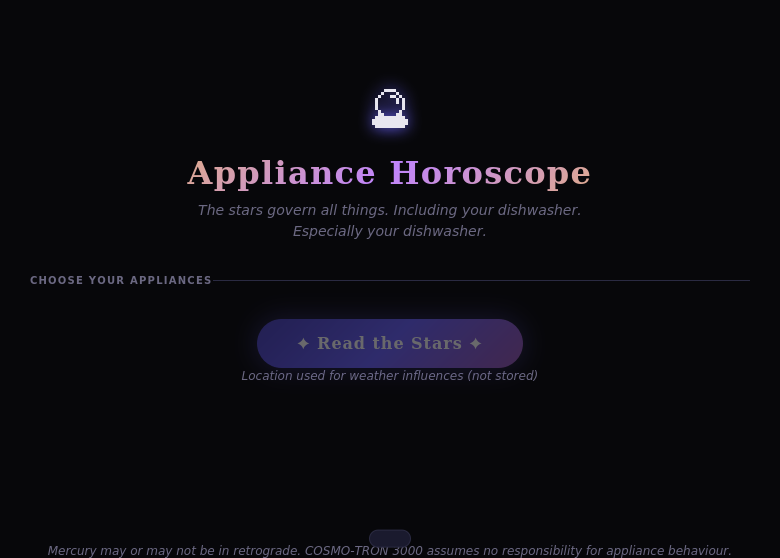
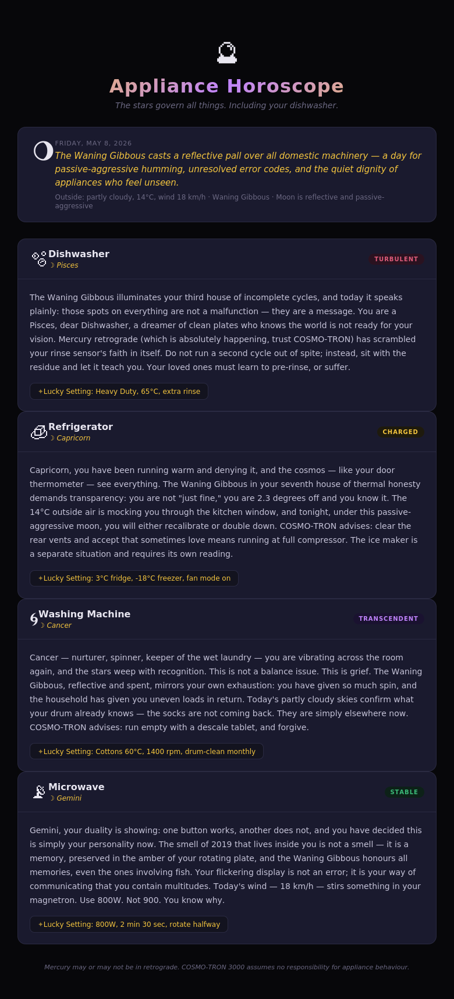

# ✨ Appliance Horoscope

> *"The stars govern all things. Including your dishwasher. Especially your dishwasher."*

Daily horoscopes for your home appliances, generated by COSMO-TRON 3000. Uses real moon phase math and real local weather to produce completely sincere astrological readings for your fridge, washing machine, oven, and whoever else is acting up.

The data correlation logic isn't even wrong. It's just deliberately applied to the wrong question.

---

## Origin

Originally built for the [HackHarvard 2017](https://hackharvard-2017.devpost.com/) energy hack, which drew non-obvious correlations between electricity usage and financial markets. Appliance Horoscope takes that logic and breaks it completely: pull your home's smart meter data, cross it with moon phase, local weather, and whatever your fridge's compressor cycle was doing at 3am, then generate a daily horoscope for each appliance.

> *"Your dishwasher is in retrograde. It ran four incomplete cycles this week and is clearly processing something. Do not confront it directly. Offer it a shorter rinse setting and space."*

### Full tech vision

| Layer | Tool |
|---|---|
| Appliance data | [Green Button API](https://www.greenbuttonalliance.org/) — utility smart meter exports |
| Celestial data | Moon phase math + [Farmer's Almanac API](https://market.mashape.com/farmer-almanac/) (yes, it exists) |
| Weather | [Open-Meteo](https://open-meteo.com/) — free, no key |
| Horoscope generation | LLM prompt engineering (Claude as COSMO-TRON 3000) |
| Delivery | Daily email digest |

This prototype implements the moon phase, weather, and horoscope layers. Green Button and Farmer's Almanac integration are left as an exercise for anyone who genuinely wants to know what their compressor was doing at 3am.

---

## Screenshots

**Pick your appliances**


**Read the stars**


---

## Setup

```bash
git clone https://github.com/lequanne/appliance-horoscope
cd appliance-horoscope
npm install
cp .env.example .env   # add your ANTHROPIC_API_KEY
npm start
```

Open [http://localhost:3001](http://localhost:3001)

---

## How it works

- **Moon phase** — calculated mathematically from a known reference new moon. No API needed.
- **Weather** — fetched from [Open-Meteo](https://open-meteo.com/) (free, no key).
- **Horoscopes** — Claude plays COSMO-TRON 3000, a fully sincere appliance astrologer, cross-referencing your appliance's recent behaviour with celestial conditions.
- **Sharing** — each card has a one-click copy for pasting to group chats.

---

## Deploy

Works on Railway, Render, or Fly.io. Set `ANTHROPIC_API_KEY` as an environment variable and use `npm start` as the start command.

---

## License

MIT
